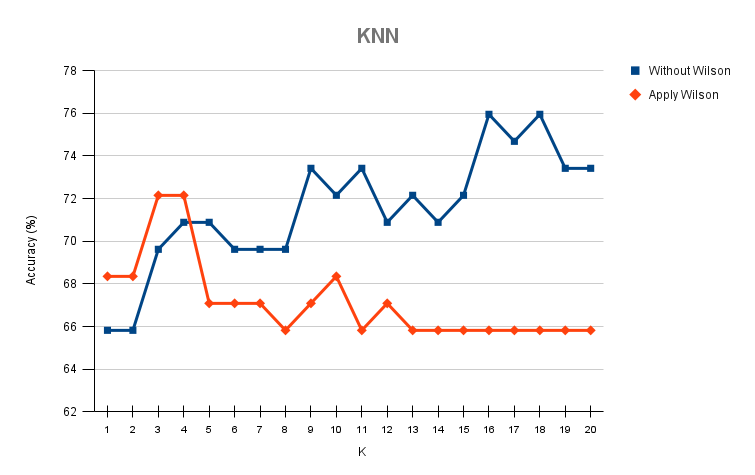

<h1 align="center"> KNN — Student Pass/Fail Prediction </h1>

<p align="center">
  
</p>

## :book: Table of Contents

<details open="open">
  <summary>Contents</summary>

1. [About the project](#about-the-project)
2. [Prerequisites and Installation](#prerequisites-and-installation)
3. [Folder Structure](#folder-structure)
4. [Dataset](#dataset)
5. [Results and Discussion](#results-and-discussion)

</details>


## :memo: About the project <a id="about-the-project"></a>

This repository contains a C implementation of a K-Nearest Neighbors (KNN) classifier and supporting utilities (normalisation and sorted lists) to predict whether a student passes or fails based on numerical attributes. The **main program is estudiantes.c** and expects two CSV files: a training file (`Train.csv`) and a test file (`Test.csv`). 

These have been obtained from the general dataset using 80% to build the Train and 20% for the Test.           


## :wrench: Prerequisites and Installation <a id="prerequisites-and-installation"></a>

- Operating system: Linux (tested on Debian/Ubuntu)
- Compiler: gcc
- Make

The project uses only the C standard library and the math library (`-lm`). No external packages are required.


From the repository root (where the `makefile` is located) run:

```bash
make
```

This will compile the object files and produce the `estudiantes` executable. The `makefile` also exposes individual targets:

```bash
make normalizar
make kmeans
make listaAlumnos
make listaOrdenada
make estudiantes
```


## :file_folder: Folder Structure <a id="folder-structure"></a>

    KNN_Students_PassOrFailed
    ├── estudiantes.c
    ├── normalizar.c/.h
    ├── kmeans.c/.h
    ├── listaAlumnos.c/.h
    ├── listaOrdenada.c/.h
    ├── makefile
    ├── Train.csv
    └── Test.csv


## :books: Dataset <a id="dataset"></a>

- The executable expects two CSV files in the repository root: `Train.csv` and `Test.csv`.
- The program reads the first line as a header and, from the second line onward, each row must contain numeric attributes separated by commas `,`.
- All attributes are parsed as integers using `atoi`. Ensure your columns are integer-formatted.

Below we can see the attributes that make up the dataset. The categorical attributes have been changed to numerical ones:

* school
* sex
* age
* address
* famsize
* Pstatus
* Medu
* Fedu
* traveltime
* studytime
* failures
* schoolsup
* famsup
* paid
* activities
* nursery
* higher
* internet
* romantic
* famrel
* freetime
* goout
* Dalc
* Walc
* health
* absences
* G1
* G2
* pass

</br>

Note: The last field in each test row is used to compare predictions and compute the accuracy percentage. It is the class to predict.


## :mag_right: Results and Discussion <a id="results-and-discussion"></a>

This section explains how to interpret the program output, which metrics to collect, and what effects to expect after applying the dataset editing step named `wilson` in the code. Because the repository contains the code but not fixed experiment logs, the text below describes reproducible steps, common observations and recommended next steps to produce a concise Results subsection for papers or reports.


* For each example in the test set the program prints a line like:

  "La prediccion del ejemplo 0 del test es: 1"

  (This is a direct output from `estudiantes.c` and reports the predicted class for the test example with its index.)

* After the first full pass over the test set the program prints an accuracy percentage line such as:

    "Hemos acertado %f%% ejemplos"

* The program then executes a function named `wilson` on the training set and repeats the prediction pass. The second prediction round and accuracy are printed again. The `wilson` step is typically a dataset-editing method (Wilson's Edited Nearest Neighbor) that removes noisy or mislabelled instances from the training set to improve generalisation.


### Ket features applied to the KNN algorithm

* **Normalization:** Since the code normalizes attributes using observed min/max values from the training set, normalization usually improves distance-based classification (KNN). If features have very different scales and you skip normalization, nearest neighbours will be dominated by large-scale features.

* **Choice of K:** The default `K` in the code is `1`. Using `K=1` is sensitive to noise; increasing `K` (e.g., 3, 5, 7) often stabilises predictions and may improve generalisation.

* **Wilson editing:** Applying the `wilson` editing step commonly reduces the training set size and removes borderline or mislabeled samples. Expected effects:
  * Training set size decreases (report this change explicitly).
  
  * Test accuracy may increase if noisy samples were harming generalisation.
  
  * In some datasets it may slightly decrease accuracy if informative borderline samples are removed.


### KNN accuracy vs K

</br>

<p align="center">
  
</p>

Key findings:

* Without Wilson: higher variance across K with noticeable peaks (~75–77%) around K = 15–18.

* With Wilson: much flatter curve (~66–67%) for mid-to-high K, indicating lower variance but a lower maximum accuracy.

* Small K behaviour: for very small K (1–3) the Wilson-edited set can match or slightly exceed the unedited result.

Interpretation:

Wilson editing reduces sensitivity to the choice of K and yields a stable but lower accuracy plateau. This pattern suggests Wilson removed borderline or contradictory training samples that increased variance; those samples may have contained informative boundary examples, so their removal improves consistency but reduces the peak achievable accuracy for some K.